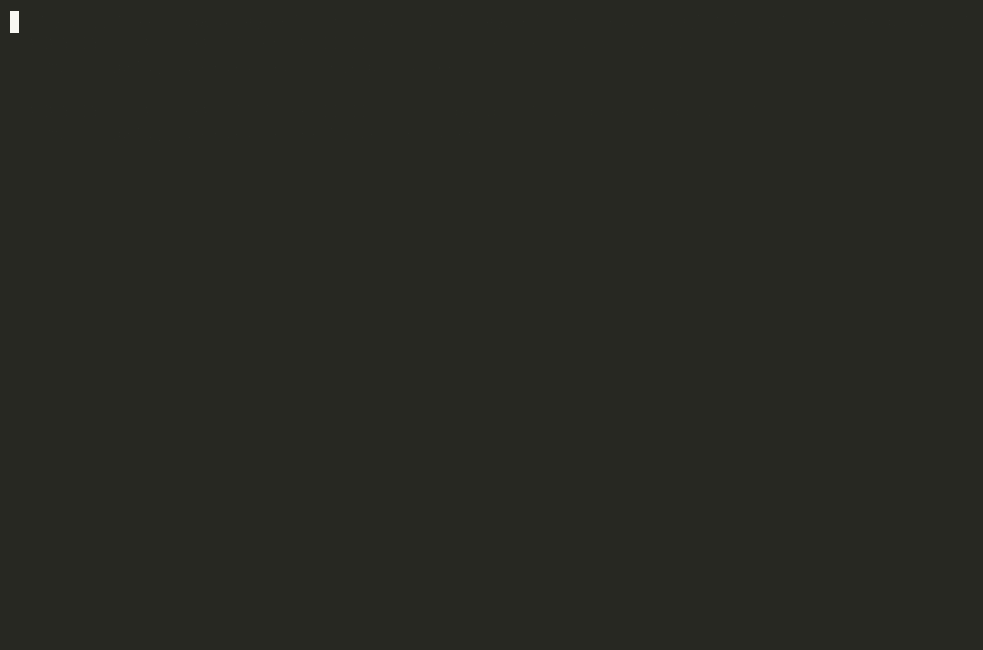
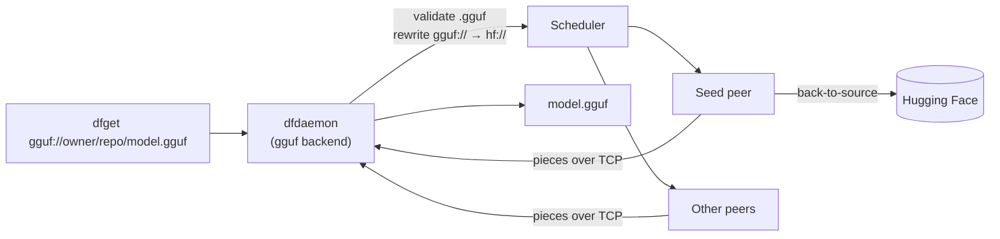

<div align="center">

# 🐉 Dragonfly GGUF Client

**Native `gguf://` model distribution for [Dragonfly](https://d7y.io) — pull GGUF models from Hugging Face over a peer-to-peer network.**


<!--  -->

</div>

---

A fork of [`dragonflyoss/client`](https://github.com/dragonflyoss/client) that adds a first-class
`gguf://` backend. Instead of pre-resolving Hugging Face URLs into raw HTTPS links (losing
revision pinning and repo structure), you point `dfget` straight at a model:

```shell
dfget gguf://bartowski/Qwen2-0.5B-Instruct-GGUF/Qwen2-0.5B-Instruct-Q4_K_M.gguf -O ./model.gguf
```

The model is split into pieces and **distributed peer-to-peer** through Dragonfly. The first peer
fetches from Hugging Face; everyone after that pulls pieces from peers and seed caches — so a fleet
of nodes downloading the same model doesn't hammer Hugging Face N times.

## ✨ Features

- **`gguf://` URL scheme** — download GGUF models by repo path, with Dragonfly P2P acceleration.
- **`.gguf`-only validation** — the backend rejects non-GGUF files with a clear error.
- **GGUF header metadata** — parse architecture, name, quantization (`general.file_type`), and
  tensor/KV counts from a GGUF file, including via a **range request** that reads just the header
  without downloading the whole model.
- **Integrity verification** — after a `gguf://` download, `dfget` fetches the file's source
  `sha256` from Hugging Face (the LFS `X-Linked-Etag`, read without following the storage
  redirect) and verifies the downloaded file against it, deleting it on mismatch. Dragonfly already
  guarantees per-piece P2P integrity; this adds an end-to-end source-corruption / wrong-file check.
  It is best-effort: if no digest is advertised the check is skipped, and only a confirmed mismatch
  fails the download.
- **Deterministic, cache-friendly** — the same `gguf://` URL always maps to the same task, so peers
  share pieces instead of re-downloading.
- **Reuses Hugging Face auth** — `--hf-token`, `--hf-revision`, and `--hf-base-url` all apply.

## 🎬 Demo

A `client` peer pulling a GGUF model from a `seed-client` over P2P, then verifying it against the
source `sha256` — recorded from a real local cluster:

<p align="center">
  
</p>

```console
$ dfget gguf://bartowski/Qwen2-0.5B-Instruct-GGUF/Qwen2-0.5B-Instruct-Q4_K_M.gguf -O /tmp/model.gguf

INFO download file to: /tmp/model.gguf
INFO flush "/tmp/model.gguf" success
INFO verifying "/tmp/model.gguf" against source sha256 ca7490f0…a3ed4a
INFO gguf integrity check passed for "/tmp/model.gguf"

$ ls -lh /tmp/model.gguf  &&  head -c4 /tmp/model.gguf
380M  /tmp/model.gguf
magic bytes: GGUF

# pieces served peer-to-peer from the seed peer (dfdaemon, protocol tcp):
finished piece 31daef4c…-3 from parent
finished piece 31daef4c…-4 from parent
```

## 🧭 How it works

`gguf://` is a thin wrapper over Dragonfly's existing Hugging Face backend. The backend validates the
`.gguf` extension and rewrites the scheme to `hf://`, then `dfdaemon` handles piece-based P2P
distribution exactly as it does for any other source.



The actual backend lives in [`dragonfly-client-backend/src/gguf.rs`](dragonfly-client-backend/src/gguf.rs),
registered alongside the other schemes (`hf`, `s3`, `http`, …) in the backend factory.

## 🚀 Installation

### Prerequisites

- A Linux environment (native Linux or WSL2). The workspace depends on Linux-only crates
  (unix sockets, `fuse`), so it does **not** build on native Windows.
- [Rust](https://rustup.rs/) — the repo pins toolchain **1.88.0** via `rust-toolchain.toml`.
- Build dependencies. On Debian/Ubuntu:

  ```shell
  sudo apt-get update
  sudo apt-get install -y git curl build-essential pkg-config \
      libssl-dev libclang-dev protobuf-compiler
  ```

  > **No `sudo`?** You can install user-local equivalents without root: a prebuilt `protoc` into
  > `~/.local/bin` (set `PROTOC`), the `libclang` Python wheel (`pip install --user libclang`, set
  > `LIBCLANG_PATH`), and point bindgen at your GCC headers via
  > `BINDGEN_EXTRA_CLANG_ARGS="-I/usr/lib/gcc/x86_64-linux-gnu/<ver>/include"`.

### Build from source

```shell
git clone https://github.com/JustDory/dragonfly-gguf-client.git
cd dragonfly-gguf-client

# Install the Rust toolchain if you don't have it.
curl --proto '=https' --tlsv1.2 -sSf https://sh.rustup.rs | sh -s -- -y
source "$HOME/.cargo/env"

# Build the client binaries (produced in target/release/).
cargo build --release --bin dfget --bin dfdaemon
./target/release/dfget --help
```

Run the backend unit tests:

```shell
cargo test -p dragonfly-client-backend gguf
```

## 📦 Usage

```shell
dfget gguf://owner/repo/model.gguf -O ./model.gguf
```

Only `.gguf` files are accepted. `dfget` forwards the request to a running `dfdaemon`, which
downloads the model and distributes it over the P2P network — so you need a `dfdaemon` (plus a
Dragonfly scheduler and manager) to talk to. See [Testing peer-to-peer locally](#-testing-peer-to-peer-locally).

Hugging Face options apply: `--hf-token` (private repos), `--hf-revision` (pin a revision),
`--hf-base-url` (mirror).

## 🌐 Testing peer-to-peer locally

A full P2P run needs a Dragonfly **manager**, **scheduler**, and at least one **peer**. The easiest
way is the official compose stack in
[dragonflyoss/dragonfly](https://github.com/dragonflyoss/dragonfly/tree/main/deploy/docker-compose),
with this fork's client image substituted for the peers.

1. **Build this fork's client image:**

   ```shell
   docker build -f ci/Dockerfile -t dragonfly-gguf-client:latest .
   ```

2. **Get the deploy compose** and point the `client` / `seed-client` services at your image:

   ```shell
   git clone https://github.com/dragonflyoss/dragonfly.git
   cd dragonfly/deploy/docker-compose
   # Set the image of the `client` and `seed-client` services to dragonfly-gguf-client:latest
   ```

3. **Two gotchas** (learned the hard way):
   - The manager/scheduler/dfdaemon validate `advertiseIP` and `host.ip` as **real IP addresses** —
     service-name hostnames are rejected. Assign each container a static IP on a custom bridge network
     (e.g. `172.30.0.0/24`) and use those IPs for the advertise fields. Connection strings
     (mysql/redis/manager `addr`) may use service names.
   - Peers come up `Restarting` until the manager and scheduler are healthy; this is expected and
     self-heals once the control plane is ready.

4. **Bring it up and download:**

   ```shell
   ./run.sh                       # or: docker compose up -d
   docker exec client dfget \
     gguf://bartowski/Qwen2-0.5B-Instruct-GGUF/Qwen2-0.5B-Instruct-Q4_K_M.gguf \
     -O /tmp/model.gguf
   ```

   The log line `load [gguf] builtin backend` confirms the backend is registered, and
   `finished piece ... from parent ...-seed using protocol tcp` confirms pieces were served
   peer-to-peer.

## 🗺️ Roadmap

- [x] `gguf://` backend with `.gguf` validation and P2P distribution
- [x] GGUF header metadata parsing (library)
- [x] Hugging Face LFS `sha256` integrity verification — wired into the `dfget` download path
- [ ] Surface parsed GGUF metadata (architecture / quantization) on the CLI
- [ ] Recursive repo download (`gguf://owner/repo` → every `.gguf` in the repo)
- [ ] Sharded / multi-part GGUF (`model-00001-of-0000N.gguf`)
- [ ] Seed-peer **preheat** for popular GGUF models
- [ ] `dfctl` support for the `gguf` scheme
- [ ] **Model discovery** — browse available models in a paged list
- [ ] **Sorting** — order the model list by *trending* and *most seeds* (P2P availability)
- [ ] **Search** — find a specific model by name / repo

Contributions toward any of these are very welcome — see below.

## 🙌 Contributing

Issues and pull requests are welcome. Please run `cargo test` and
`cargo clippy --all-targets -- -D warnings` before submitting. See
[CONTRIBUTING](./CONTRIBUTING.md) for the broader Dragonfly contribution guide.

## 📄 License & acknowledgements

Licensed under the [Apache License 2.0](./LICENSE). Built on top of the excellent
[Dragonfly](https://github.com/dragonflyoss/dragonfly) project by the Dragonfly Authors and the
CNCF community.

## 💬 Community (upstream Dragonfly)

- **Slack**: [#dragonfly](https://cloud-native.slack.com/messages/dragonfly/) on [CNCF Slack](https://slack.cncf.io/)
- **GitHub Discussions**: [Dragonfly Discussion Forum](https://github.com/dragonflyoss/dragonfly/discussions)
- **Twitter**: [@dragonfly_oss](https://twitter.com/dragonfly_oss)
