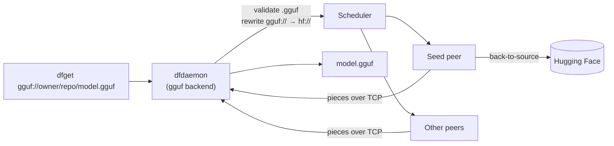
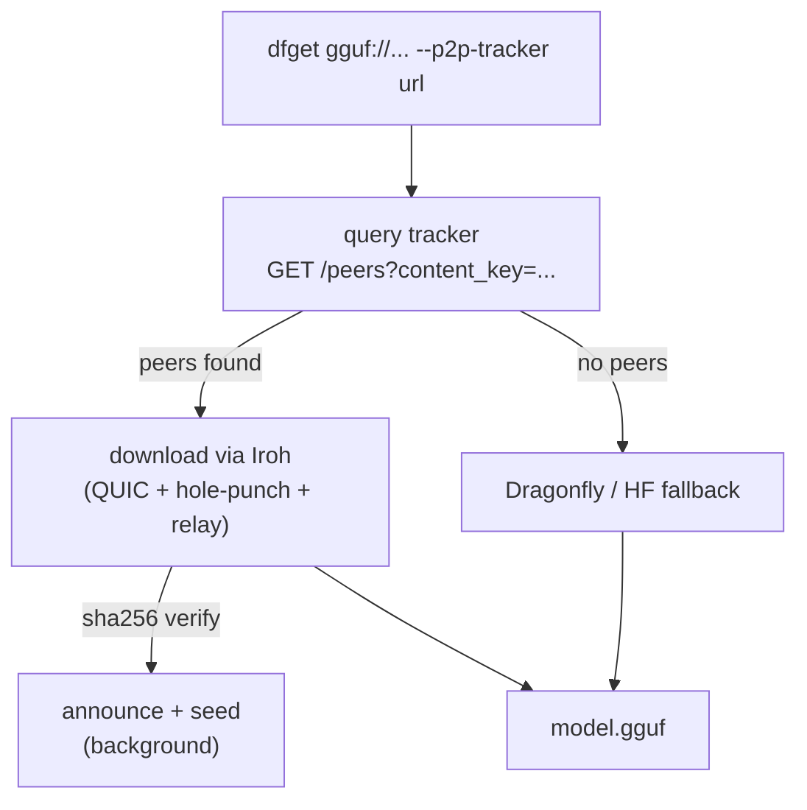

<div align="center">

# 🐉 Dragonfly GGUF Client

**Native `gguf://` model distribution — pull GGUF models from Hugging Face over a peer-to-peer network, with optional NAT-transparent sharing between any two machines on the internet.**


</div>

---

A fork of [`dragonflyoss/client`](https://github.com/dragonflyoss/client) that adds two complementary
peer-to-peer delivery mechanisms for GGUF models:

| | **Dragonfly P2P** | **Iroh P2P** |
|---|---|---|
| Best for | Clusters / datacenters | Individual users / home networks |
| NAT traversal | Requires routable IPs | Built-in (QUIC + hole-punch + relay) |
| Setup | Manager + scheduler + peers | Just `--p2p-tracker <url>` |
| Discovery | Dragonfly scheduler | Lightweight HTTP tracker |

```shell
# Dragonfly P2P (requires a running cluster)
dfget gguf://bartowski/Qwen2-0.5B-Instruct-GGUF/Qwen2-0.5B-Instruct-Q4_K_M.gguf -O ./model.gguf

# Iroh P2P (works from any network, no signup)
dfget gguf://bartowski/Qwen2-0.5B-Instruct-GGUF/Qwen2-0.5B-Instruct-Q4_K_M.gguf \
  -O ./model.gguf --p2p-tracker http://your-tracker:8080
```

## ✨ Features

- **`gguf://` URL scheme** — download GGUF models by repo path, with P2P acceleration.
- **`.gguf`-only validation** — the backend rejects non-GGUF files with a clear error.
- **GGUF header metadata** — parse architecture, name, quantization (`general.file_type`), and
  tensor/KV counts from a GGUF file, including via a **range request** that reads just the header
  without downloading the whole model.
- **Integrity verification** — after a `gguf://` download, `dfget` fetches the file's source
  `sha256` from Hugging Face (the LFS `X-Linked-Etag`, read without following the storage
  redirect) and verifies the downloaded file against it, deleting it on mismatch. It is
  best-effort: if no digest is advertised the check is skipped; only a confirmed mismatch fails
  the download.
- **Deterministic, cache-friendly** — the same `gguf://` URL always maps to the same task, so peers
  share pieces instead of re-downloading.
- **Iroh P2P** — NAT-transparent peer discovery and transfer using QUIC with automatic hole-punching
  and relay fallback. Works from home NATs, laptops, and mobile hotspots without any VPN or port
  forwarding. After a download you automatically seed the model to other peers.
- **Reuses Hugging Face auth** — `--hf-token`, `--hf-revision`, and `--hf-base-url` all apply.

## 🎬 Demo

A `client` peer pulling a GGUF model from a `seed-client` over P2P, then verifying it against the
source `sha256` — recorded from a real local cluster:

<p align="center">
  
</p>

```console
$ dfget gguf://bartowski/Qwen2-0.5B-Instruct-GGUF/Qwen2-0.5B-Instruct-Q4_K_M.gguf -O /tmp/model.gguf

INFO download file to: /tmp/model.gguf
INFO flush "/tmp/model.gguf" success
INFO verifying "/tmp/model.gguf" against source sha256 ca7490f0…a3ed4a
INFO gguf integrity check passed for "/tmp/model.gguf"

$ ls -lh /tmp/model.gguf  &&  head -c4 /tmp/model.gguf
380M  /tmp/model.gguf
magic bytes: GGUF

# pieces served peer-to-peer from the seed peer (dfdaemon, protocol tcp):
finished piece 31daef4c…-3 from parent
finished piece 31daef4c…-4 from parent
```

## 🧭 How it works

### Dragonfly path (cluster mode)

`gguf://` is a thin wrapper over Dragonfly's existing Hugging Face backend. The backend validates the
`.gguf` extension and rewrites the scheme to `hf://`, then `dfdaemon` handles piece-based P2P
distribution exactly as it does for any other source.



### Iroh P2P path (permissionless mode)

Before handing off to Dragonfly, `dfget` queries a lightweight tracker for peers who already have
the model. If any are found it downloads directly over Iroh (QUIC with automatic NAT traversal),
then seeds to the next user. Falls back to Dragonfly automatically if no peers are available.



**Content key** = `sha256_hex("hf://owner/repo/model.gguf:revision")` — stable and identical across
all peers for the same model and revision.

## 🚀 Installation

### Prerequisites

- A Linux environment (native Linux or WSL2). The workspace depends on Linux-only crates
  (unix sockets, `fuse`), so it does **not** build on native Windows.
- [Rust](https://rustup.rs/) — the repo uses the `stable` channel (currently 1.96; minimum 1.91
  required by Iroh).
- Build dependencies. On Debian/Ubuntu:

  ```shell
  sudo apt-get update
  sudo apt-get install -y git curl build-essential pkg-config \
      libssl-dev libclang-dev protobuf-compiler
  ```

  > **No `sudo`?** You can install user-local equivalents without root: a prebuilt `protoc` into
  > `~/.local/bin` (set `PROTOC`), the `libclang` Python wheel (`pip install --user libclang`, set
  > `LIBCLANG_PATH`), and point bindgen at your GCC headers via
  > `BINDGEN_EXTRA_CLANG_ARGS="-I/usr/lib/gcc/x86_64-linux-gnu/<ver>/include"`.

### Build from source

```shell
git clone https://github.com/JustDory/dragonfly-gguf-client.git
cd dragonfly-gguf-client

# Install the Rust toolchain if you don't have it.
curl --proto '=https' --tlsv1.2 -sSf https://sh.rustup.rs | sh -s -- -y
source "$HOME/.cargo/env"

# Build all binaries (dfget, dfdaemon, dragonfly-tracker).
cargo build --release

# Or just the client if you don't need the tracker or daemon.
cargo build --release --bin dfget
```

Run the tests:

```shell
cargo test -p dragonfly-client-backend gguf   # gguf backend unit tests
cargo test -p dragonfly-client-p2p            # P2P layer unit tests + loopback
```

## 📦 Usage

### Dragonfly P2P

```shell
dfget gguf://owner/repo/model.gguf -O ./model.gguf
```

Requires a running `dfdaemon` with a Dragonfly scheduler and manager. See
[Testing peer-to-peer locally](#-testing-peer-to-peer-locally).

### Iroh P2P (permissionless)

```shell
dfget gguf://owner/repo/model.gguf -O ./model.gguf \
  --p2p-tracker http://your-tracker:8080
```

For discovery and download, no cluster is needed: `dfget` checks the tracker for peers, downloads
from the first available one, and verifies the sha256.

**Seeding** (sharing what you downloaded back to the swarm) is handled by `dfdaemon`, not `dfget` —
`dfget` is a short-lived command and can't keep an Iroh endpoint alive after it exits. Instead it
writes a small *seed manifest* to a shared registry directory, and a `dfdaemon` running with seeding
enabled hosts one persistent Iroh endpoint that serves every registered file until its manifest
expires. See [Enabling seeding](#enabling-seeding-dfdaemon).

**All `--p2p-*` flags:**

| Flag | Default | Env var | Description |
|---|---|---|---|
| `--p2p-tracker <url>` | *(community tracker)* | `DRAGONFLY_P2P_TRACKER` | Tracker URL for peer discovery |
| `--no-p2p` | false | `DRAGONFLY_NO_P2P` | Skip Iroh P2P entirely |
| `--prefer-dragonfly` | false | `DRAGONFLY_PREFER_DRAGONFLY` | Skip Iroh, go straight to Dragonfly |
| `--seed-time <secs>` | 3600 | `DRAGONFLY_SEED_TIME` | How long the registered seed stays live |
| `--iroh-keypair <path>` | `~/.config/dragonfly/iroh.key` | `DRAGONFLY_IROH_KEYPAIR` | Persistent Iroh node identity |

Hugging Face options also apply: `--hf-token` (private repos), `--hf-revision` (pin a revision),
`--hf-base-url` (mirror).

### Enabling seeding (dfdaemon)

Run `dfdaemon` with `DRAGONFLY_GGUF_SEED=1`. It watches the seed registry
(`$XDG_DATA_HOME/dragonfly/gguf-seeds`, override with `DRAGONFLY_GGUF_SEED_REGISTRY`) and seeds every
file `dfget` registers there:

```shell
DRAGONFLY_GGUF_SEED=1 dfdaemon --config /path/to/config.yaml
```

The registry is just JSON files on disk, so seeding **survives a daemon restart** — on boot the
daemon resumes serving every manifest that hasn't expired. When a manifest expires (or its source
file is deleted), the daemon de-announces it from the tracker and removes the manifest, so peers are
never handed a node that's about to disappear.

### Fallback order

1. Iroh P2P — if `--p2p-tracker` is set and peers are found
2. Dragonfly scheduler — if `--no-p2p` / `--prefer-dragonfly`, or no Iroh peers available
3. Hugging Face direct — if the Dragonfly scheduler is unreachable (existing fallback, unchanged)

## 🔭 Running the tracker

The `dragonfly-tracker` binary is a lightweight HTTP peer-discovery service. Run one anywhere with
a public IP (or behind a reverse proxy):

```shell
# Start on port 8080
./target/release/dragonfly-tracker --bind 0.0.0.0:8080

# Options
./target/release/dragonfly-tracker --help
# --bind <addr>         Listen address (default: 0.0.0.0:8080)
# --ttl <secs>          Peer TTL before eviction (default: 1800)
# --rate-limit <n>      Max announces per IP per minute (default: 10)
```

**Using Docker:**

```shell
cd deploy/tracker
docker compose up -d

# Or build and run manually
docker build -t dragonfly-tracker .
docker run -p 8080:8080 dragonfly-tracker
```

**Tracker API:**

```
POST /announce
  Body: { "content_key": "<64-char hex>", "node_id": "<iroh node id>", "addr_info": "<json>" }

GET /peers?content_key=<64-char hex>
  Response: { "providers": [{ "node_id": "...", "addr_info": "...", "last_seen": <unix ts> }] }

DELETE /leave
  Body: { "content_key": "...", "node_id": "..." }
```

## 🌐 Testing Iroh P2P locally

```shell
# 1. Start the tracker
./target/debug/dragonfly-tracker --bind 127.0.0.1:8080 &

# 2. Start a daemon with seeding enabled (hosts the persistent Iroh endpoint)
DRAGONFLY_GGUF_SEED=1 ./target/debug/dfdaemon --config /path/to/config.yaml &

# 3. Download (first time — no peers yet, falls back to Dragonfly/HF).
#    On success dfget writes a seed manifest; the daemon then announces + serves it.
dfget gguf://bartowski/Qwen2-0.5B-Instruct-GGUF/Qwen2-0.5B-Instruct-Q4_K_M.gguf \
  -O /tmp/model.gguf --p2p-tracker http://127.0.0.1:8080

# 4. Second download from a different output path — should hit the P2P peer
dfget gguf://bartowski/Qwen2-0.5B-Instruct-GGUF/Qwen2-0.5B-Instruct-Q4_K_M.gguf \
  -O /tmp/model2.gguf --p2p-tracker http://127.0.0.1:8080
# Watch for: "found N P2P provider(s)" and "P2P download complete" in the logs.

# 5. Verify they match
sha256sum /tmp/model.gguf /tmp/model2.gguf
```

> The automated equivalent of this flow runs in CI as
> `cargo test -p dragonfly-client-p2p --test registry_e2e`: it starts an in-process tracker, runs
> the seed service against a registered manifest, and downloads the file back over Iroh.

For a cross-machine test, deploy the tracker to a public server and have two machines (even behind
different home NATs) both point at it. Iroh's relay will bridge the initial connection, and
hole-punching will usually establish a direct path after that.

**Disable P2P to force the Dragonfly path:**
```shell
dfget gguf://... -O ./model.gguf --no-p2p
```

## 🌐 Testing Dragonfly P2P locally

A full P2P run needs a Dragonfly **manager**, **scheduler**, and at least one **peer**. The easiest
way is the official compose stack in
[dragonflyoss/dragonfly](https://github.com/dragonflyoss/dragonfly/tree/main/deploy/docker-compose),
with this fork's client image substituted for the peers.

1. **Build this fork's client image:**

   ```shell
   docker build -f ci/Dockerfile -t dragonfly-gguf-client:latest .
   ```

2. **Get the deploy compose** and point the `client` / `seed-client` services at your image:

   ```shell
   git clone https://github.com/dragonflyoss/dragonfly.git
   cd dragonfly/deploy/docker-compose
   # Set the image of the `client` and `seed-client` services to dragonfly-gguf-client:latest
   ```

3. **Two gotchas** (learned the hard way):
   - The manager/scheduler/dfdaemon validate `advertiseIP` and `host.ip` as **real IP addresses** —
     service-name hostnames are rejected. Assign each container a static IP on a custom bridge network
     (e.g. `172.30.0.0/24`) and use those IPs for the advertise fields. Connection strings
     (mysql/redis/manager `addr`) may use service names.
   - Peers come up `Restarting` until the manager and scheduler are healthy; this is expected and
     self-heals once the control plane is ready.

4. **Bring it up and download:**

   ```shell
   ./run.sh                       # or: docker compose up -d
   docker exec client dfget \
     gguf://bartowski/Qwen2-0.5B-Instruct-GGUF/Qwen2-0.5B-Instruct-Q4_K_M.gguf \
     -O /tmp/model.gguf
   ```

   The log line `load [gguf] builtin backend` confirms the backend is registered, and
   `finished piece ... from parent ...-seed using protocol tcp` confirms pieces were served
   peer-to-peer.

## 🗺️ Roadmap

- [x] `gguf://` backend with `.gguf` validation and P2P distribution
- [x] GGUF header metadata parsing (library)
- [x] Hugging Face LFS `sha256` integrity verification — wired into the `dfget` download path
- [x] **Iroh P2P** — permissionless NAT-transparent peer sharing with automatic seeding
- [x] `dragonfly-tracker` — lightweight peer-discovery HTTP service
- [ ] Deploy community tracker at `tracker.dragonfly-gguf.dev`
- [ ] Surface parsed GGUF metadata (architecture / quantization) on the CLI
- [ ] Recursive repo download (`gguf://owner/repo` → every `.gguf` in the repo)
- [ ] Sharded / multi-part GGUF (`model-00001-of-0000N.gguf`)
- [ ] Seed-peer **preheat** for popular GGUF models
- [ ] `dfctl` support for the `gguf` scheme
- [ ] **Model discovery** — browse available models in a paged list
- [ ] **Sorting** — order the model list by *trending* and *most seeds* (P2P availability)
- [ ] **Search** — find a specific model by name / repo

Contributions toward any of these are very welcome — see below.

## 🙌 Contributing

Issues and pull requests are welcome. Please run `cargo test` and
`cargo clippy --all-targets -- -D warnings` before submitting. See
[CONTRIBUTING](./CONTRIBUTING.md) for the broader Dragonfly contribution guide.

## 📄 License & acknowledgements

Licensed under the [Apache License 2.0](./LICENSE). Built on top of the excellent
[Dragonfly](https://github.com/dragonflyoss/dragonfly) project by the Dragonfly Authors and the
CNCF community. Iroh P2P layer powered by [iroh](https://github.com/n0-computer/iroh) from
[n0-computer](https://github.com/n0-computer).

## 💬 Community (upstream Dragonfly)

- **Slack**: [#dragonfly](https://cloud-native.slack.com/messages/dragonfly/) on [CNCF Slack](https://slack.cncf.io/)
- **GitHub Discussions**: [Dragonfly Discussion Forum](https://github.com/dragonflyoss/dragonfly/discussions)
- **Twitter**: [@dragonfly_oss](https://twitter.com/dragonfly_oss)
